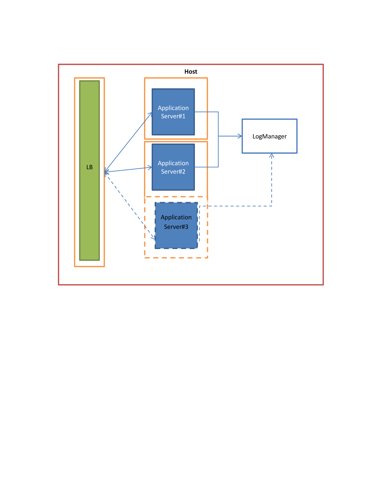

MumbaiDockers
=============
MumbaiDockers would like to contribute to a problem of ‘auto-migration’ of an application. As Docker suggests that 
there is no need to auto-migrate, we just need to spin up a new instance; MumbaiDockers is aiming to achieve an
auto-scaling of the application stack.

The architecture below displays a typical application stack with a Load Balancer (LB) in a docker-container 
front-ending two application servers – Application Server#1 and Application Server#2, both in their respective 
docker-containers and writing to a LogManager in the Host environment. Assuming the increase in user requests detected automatically, a new instance is spawn on the fly and automatically configured to balance the load out in an elastic auto-scaling mode.

Below Image is an Architecture of what we have planned so far.

